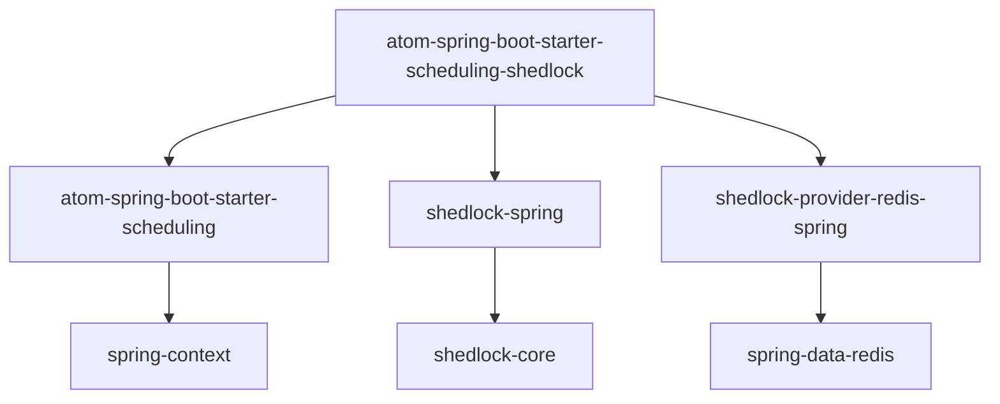

# Atom Spring Boot Starter Scheduling ShedLock

[](http://license.coscl.org.cn/MulanPSL2)
[](https://search.maven.org/artifact/cn.mindit/atom-spring-boot-starter-scheduling-shedlock)

`atom-spring-boot-starter-scheduling-shedlock` 是 Atom 框架的分布式调度锁模块，基于 [ShedLock](https://github.com/lukas-krecan/shedlock) 实现，确保定时任务在集群环境中的唯一性，防止重复执行。

## 功能特性

- 🚀 **开箱即用**：基于 Spring Boot AutoConfiguration，零配置启动
- 🔒 **分布式锁**：使用 Redis 作为锁存储，支持集群环境
- ⏰ **任务调度**：与 Spring `@Scheduled` 注解完美集成
- 🛡️ **故障恢复**：自动释放死锁，防止任务永久阻塞
- 📊 **监控友好**：提供锁状态查询和监控接口
- 🎯 **轻量级**：最小化依赖，无侵入式集成

## 快速开始

### 1. 添加依赖

```xml

<dependency>
  <groupId>cn.mindit</groupId>
  <artifactId>atom-spring-boot-starter-scheduling-shedlock</artifactId>
  <version>${atom.version}</version>
</dependency>
```

### 2. 配置 Redis

确保你的应用已配置 Redis 连接：

```yaml
spring:
  redis:
    host: localhost
    port: 6379
    password: your-password
    database: 0
```

### 3. 使用注解

在你的定时任务上添加 `@SchedulerLock` 注解：

```java
import org.springframework.scheduling.annotation.Scheduled;
import net.javacrumbs.shedlock.spring.annotation.SchedulerLock;
import lombok.extern.slf4j.Slf4j;

@Slf4j
@Service
public class LightingService {

    @Scheduled(cron = "0 0 8 * * *")
    @SchedulerLock(name = "LightingService:turnOn")
    public void turnOn() {
        log.info("开灯任务执行");
        // 业务逻辑
    }

    @Scheduled(cron = "0 0 20 * * *")
    @SchedulerLock(name = "LightingService:turnOff")
    public void turnOff() {
        log.info("关灯任务执行");
        // 业务逻辑
    }

    @Scheduled(fixedDelay = 60000) // 每分钟执行
    @SchedulerLock(
        name = "DataSyncTask",
        lockAtMostFor = "5m",    // 锁最大持有时间
        lockAtLeastFor = "30s"   // 锁最小持有时间
        )
    public void syncData() {
        log.info("数据同步任务执行");
        // 业务逻辑
    }

}
```

## 核心概念

### @SchedulerLock 注解参数

| 参数               | 类型     | 必填 | 默认值   | 说明             |
|------------------|--------|----|-------|----------------|
| `name`           | String | ✅  | -     | 锁名称，必须唯一       |
| `lockAtMostFor`  | String | ❌  | "10m" | 锁最大持有时间，防止死锁   |
| `lockAtLeastFor` | String | ❌  | "1s"  | 锁最小持有时间，防止重复执行 |

### 锁时间配置建议

- **lockAtMostFor**：设置为任务正常执行时间的 2-3 倍，确保即使节点宕机也能释放锁
- **lockAtLeastFor**：设置为任务执行间隔的 50%-80%，防止同一任务在短时间内重复执行

## 配置选项

### 应用配置

```yaml
atom:
  scheduling:
    shedlock:
      enabled: true  # 是否启用 ShedLock（默认: true）
```

### 高级配置

如果需要自定义 Redis 锁提供者，可以覆盖默认配置：

```java

@Configuration
public class CustomShedLockConfiguration {

    @Bean
    @Primary
    public LockProvider customLockProvider(RedisConnectionFactory connectionFactory) {
        return new RedisLockProvider(connectionFactory, "custom-environment");
    }

}
```

## 使用场景

### 1. 数据同步任务

```java

@Scheduled(cron = "0 0/30 * * * ?") // 每30分钟执行
@SchedulerLock(name = "DataSyncTask", lockAtMostFor = "25m")
public void syncUserData() {
    // 从其他系统同步用户数据
    userService.syncFromExternalSystem();
}
```

### 2. 报表生成任务

```java

@Scheduled(cron = "0 0 1 * * ?") // 每天凌晨1点执行
@SchedulerLock(name = "ReportGenerationTask", lockAtMostFor = "2h")
public void generateDailyReport() {
    // 生成日报表
    reportService.generateDailyReport();
}
```

### 3. 清理任务

```java

@Scheduled(cron = "0 0 2 * * ?") // 每天凌晨2点执行
@SchedulerLock(name = "CleanupTask", lockAtMostFor = "1h")
public void cleanupExpiredData() {
    // 清理过期数据
    dataCleanupService.removeExpiredData();
}
```

## 最佳实践

### 1. 锁命名规范

建议使用 `{ServiceName}:{MethodName}` 格式：

```java
// ✅ 推荐
@SchedulerLock(name = "UserService:syncData")
@SchedulerLock(name = "ReportService:generateDailyReport")

// ❌ 不推荐
@SchedulerLock(name = "task1")
@SchedulerLock(name = "sync")
```

### 2. 异常处理

在任务中添加适当的异常处理：

```java

@Scheduled(cron = "0 0/10 * * * ?")
@SchedulerLock(name = "HeartbeatTask", lockAtMostFor = "8m")
public void heartbeat() {
    try {
        // 业务逻辑
        healthCheckService.check();
    } catch (Exception e) {
        log.error("心跳检查失败", e);
        // 不要重新抛出异常，避免任务被标记为失败
    }
}
```

### 3. 任务监控

```java

@Scheduled(cron = "0 0/5 * * * ?")
@SchedulerLock(name = "MonitorTask")
public void monitor() {
    // 可以使用 LockAssert 检查锁状态
    LockAssert.assertLocked();

    // 监控逻辑
    monitoringService.collectMetrics();
}
```

## 故障排除

### 常见问题

**Q: 任务没有执行？**

- 检查 `@Scheduled` 表达式是否正确
- 确认 Spring 调度已启用（`@EnableScheduling`）
- 验证 Redis 连接是否正常

**Q: 任务重复执行？**

- 检查 `@SchedulerLock` 注解是否添加
- 确认锁名称是否唯一
- 验证 `lockAtLeastFor` 设置是否合理

**Q: 锁无法释放？**

- 检查 `lockAtMostFor` 设置是否过短
- 确认任务执行时间是否超过预期
- 监控 Redis 连接状态

### 调试技巧

启用 DEBUG 日志级别：

```yaml
logging:
  level:
    net.javacrumbs.shedlock: DEBUG
    cn.mindit.atom.scheduling.shedlock: DEBUG
```

### Redis 锁查看

```bash
# 查看当前锁状态
redis-cli KEYS "shedlock:*"

# 查看锁详情
redis-cli GET "shedlock:your-lock-name"
```

## 性能优化

### 1. Redis 连接池配置

```yaml
spring:
  redis:
    lettuce:
      pool:
        max-active: 20
        max-idle: 10
        min-idle: 5
        max-wait: 1000ms
```

### 2. 锁粒度控制

避免过于频繁的任务：

```java
// ✅ 合理的频率
@Scheduled(fixedDelay = 60000) // 每分钟
@SchedulerLock(name = "FrequentTask")

// ❌ 过于频繁的频率
@Scheduled(fixedDelay = 1000) // 每秒
@SchedulerLock(name = "TooFrequentTask")
```

## 技术架构

```
┌─────────────────────────────────────────────────────────────┐
│                    Spring Boot 应用                          │
├─────────────────────────────────────────────────────────────┤
│  @Scheduled 方法 ────→ @SchedulerLock ────→ ShedLock AOP     │
│                       │                                    │
│                       ▼                                    │
│              RedisLockProvider                              │
│                       │                                    │
│                       ▼                                    │
│                    Redis 集群                               │
│              ┌─────────────┬─────────────┐                  │
│              │    节点A     │    节点B     │                  │
│              │  获取锁成功  │  获取锁失败  │                  │
│              └─────────────┴─────────────┘                  │
└─────────────────────────────────────────────────────────────┘
```

## 依赖关系



## 贡献指南

欢迎提交 Issue 和 Pull Request！

1. Fork 本仓库
2. 创建特性分支 (`git checkout -b feature/AmazingFeature`)
3. 提交更改 (`git commit -m 'Add some AmazingFeature'`)
4. 推送到分支 (`git push origin feature/AmazingFeature`)
5. 创建 Pull Request

## 许可证

本项目基于 [Mulan PSL v2](http://license.coscl.org.cn/MulanPSL2) 许可证开源。

## 作者

- **Catch** - *初始开发* - [GitHub](https://github.com/catch6)

## 致谢

- [ShedLock](https://github.com/lukas-krecan/shedlock) - 核心分布式锁实现
- [Spring Boot](https://spring.io/projects/spring-boot) - 优秀的应用框架

---

<p align="center">
  <strong>如果这个项目对你有帮助，请给我们一个 ⭐️</strong>
</p>